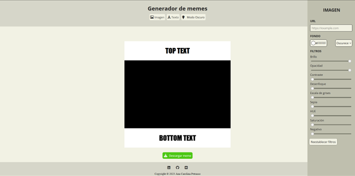
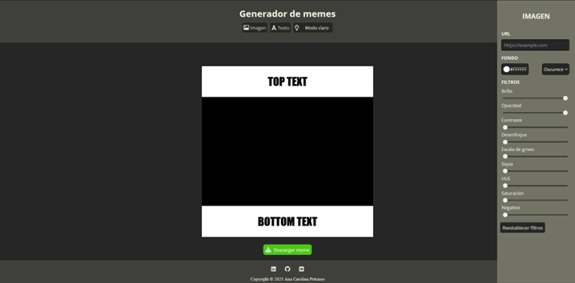
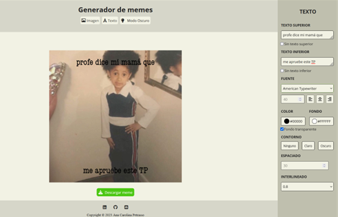
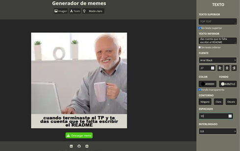
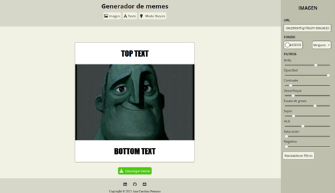
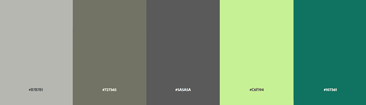
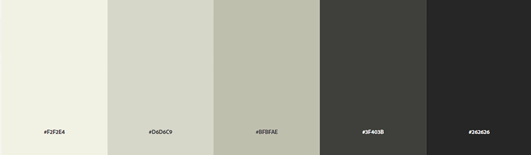

# Editor de memes 

Este es un generador de memes creado para presentar como profecto final del **Módulo 2 - JavaScript** para el curso de desarrollo frontend de ADA.
17va Frontend Online.

## Contenido 
- [Sobre la pagina](#sobre-la-pagina-🖥️) 
    - [Estructura](#estructura) 
    - [Paleta de colores](#paleta-de-colores)
    - [Fuente](#fuente)
    - [Imágenes](#imágenes) 
    - [Screenshots](#screenshots)
- [Sobre mi](#sobre-mi-👩‍💻) 
---  
## Sobre la pagina 🖥️

### Estructura 

El diseño de la aplicación  se baso en el modelo pedido por la catedra que podes ver [aqui](https://frontend-proyecto-meme.adaitw.org/).

Lo importante de este trabajo es la impimentación de JavaScript para las distintas funcionalidades que permiten editar el meme, manipulando el DOM.

La aplicacion alterna entre modo claro y modo oscuro permitiendo una mejor accesibilidad a la pagina.

Los paneles de "IMAGEN" y "TEXTO" se alternan y cada uno permite modificar distintos aspectos del meme como la saturación de la imagen, su opaciodad y el color de texto entre otros. 

### Paleta de colores
La paleta de colores usada es:

### Fuentes
La fuente usada para la pagina es **Open Sans**. Y para el editor de memes se utilizan:
- Arial
- Arial Black
- American Typewriter
- Andale Mono
- Comic Sans MS
- Helvetica
- Impact
- Verdana
- Times New Roman 

### Imágenes 
Los iconos utilizados son de: 
- [Font Awesome](https://fontawesome.com/)

## Sobre mi 👩‍💻
Soy estudiante de Desarrollo Frontend en ADA, estudiante de ingenieria química y profesora de química. 

Por dudas, comentarios o trabajo podes contactarme a traves de:
- carolina15petrasso@gmail.com  
- [Linkedin](https://www.linkedin.com/in/ana-carolina-petrasso/)
- [GitHub](https://github.com/AnaCPetrasso)

[Volver](#contenido)